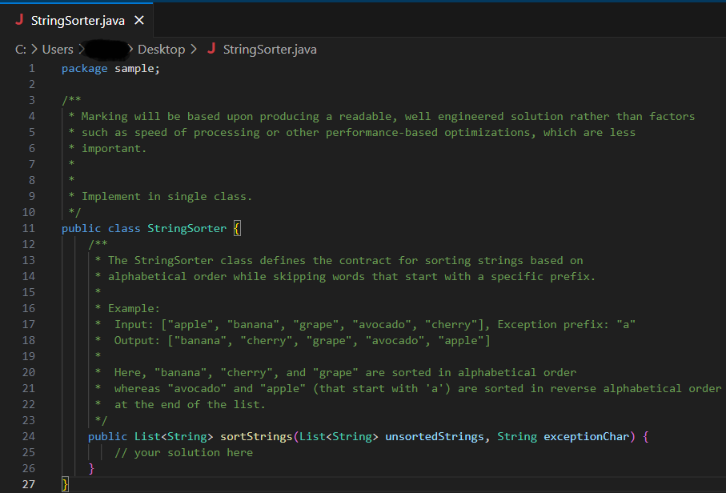

# String-sorter
### test task

### 📜 Description

OR text

        Marking will be based upon producing a readable, well engineered solution rather
    than factors such as speed of processing or other performance-based optimizations, which
    are less important.
        Implement in single class.
 
    public class StringSorter {
        //The StringSorter class defines the contract for sorting strings based on
        //alphabetical order while skipping words that start with a specific prefix.
    
        //Example:
        //   Input: ["apple", "banana", "grape", "avocado", "cherry"], Exception prefix: "a"
        //   Output: ["banana", "cherry", "grape", "avocado", "apple"]
    
        //Here, "banana", "cherry", and "grape" are sorted in alphabetical order
        //whereas "avocado" and "apple" (that start with 'a') are sorted 
        //in reverse alphabetical order at the end of the list.
       
        public List<String> sortStrings(List<String> unsortedStrings, String exceptionChar) {
            // your solution here
        }
    }

### ⚙️ Used technologies

| Technology        |
|:------------------|
| JDK - 17          |
| Maven - 3.1.1     |
| JUnit 5 - 5.8.2   |
| Stream API        |
| Checkstyle plugin |

### 📌 Author
#### Oleksandr Krasnov  [LinkedIn](https://www.linkedin.com/in/oleksandr-krasnov)